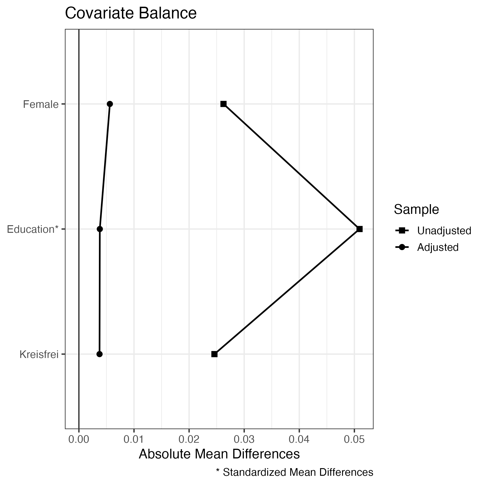

```{r setup, include=FALSE}
knitr::opts_chunk$set(echo = TRUE, fig.pos = "!H", message=FALSE, warning=FALSE)

## Clear working memory
rm(list = ls())

source('code/functions.R')

## Load (, if necessary, install) packages and set working directory -----------

## Install packages if not installed
p_needed <-
  c(
    "haven",
    "dplyr",
    "data.table",
    "ggplot2",
    "tidyverse",
    "MatchIt",
    "dotwhisker",
    "broom",
    "rddtools",
    "cobalt",
    "stargazer",
    "rdrobust",
    "ggpubr",
    "texreg",
    "extrafont",
    "viridis",
    "kableExtra",
    "ggbrace",
    "extrafont",
    "remotes",
    "devtools",
    "labelled"
    
  )

# Compare needed and installed packages
packages <- rownames(installed.packages())
p_to_install <- p_needed[!(p_needed %in% packages)]

# If a package is not installed yet, install it
if (length(p_to_install) > 0) {
  install.packages(p_to_install)
}

# Load all the packages in the environment
sapply(p_needed, require, character.only = TRUE)

if (!"ggbrace" %in% installed.packages()) {devtools::install_github("NicolasH2/ggbrace")}
library(ggbrace)

# # Load and if necessary install packages in development
# # THis is for balance_plot (not used at the moment)
# if(!('DAPSm' %in% packages)) remotes::install_github('gpapadog/DAPSm')
# library(DAPSm)

# Load fonts
loadfonts()


# remove objects, which are no longer needed
rm(p_needed, p_to_install, packages)


## Load data -------------------------------------------------------------------

source2('code/data.R', 63,288) # this does the data prep for us. 
# Limited to lines 63-313 (end) as we already got all the packages needed.
```

# Main Text

## Table 1

```{r Table 1, echo=TRUE, message=FALSE, warning=FALSE}
# Table one was created manually. The following code returns the values for column N
table(g12w12$group[g12w12$wave == 1])
```

**Table 1.** The control group (1) comprises persons entitled to vote in the national election and all following elections because they were 18 on the day of the national election, the treatment group (2) comprises persons entitled to vote in the state and municipal elections only because they were aged 16 or 17 on the day of the national election. N = respondents who participated in both waves 1 and 2.

## Figure 1

```{r Figure 1, echo=TRUE, results='hide', message=FALSE, warning=FALSE, fig.height=5, fig.width = 7, fig.pos="!H", fig.cap="**Figure 1.** Visualization of the difference-in-differences design using data from all three waves of the survey. The graph plots mean values of external efficacy after the three elections in the treatment (dark grey) and control group (black) -- light grey dots represent data not used in the specific analysis. Solid lines connect observed values (dots). The dashed line illustrates the parallel trends assumption, which constructs the counterfactual (circle) from the pre-treatment value in the treatment group and the trend in the control group. The difference between counterfactual and observed value represents the treatment effect."}


loadfonts()


# Generate group-specific means for example figure of DiD
dfig <-
  g123w123 %>%
  filter(group != 3, wave2 == T | wave3 == T) %>%
  group_by(group, wave) %>%
  summarize(ext_eff = mean(ext_eff, na.rm = T))


# Build panels 1-3 separately...

# Panel 1: Waves 1 and 2
f_did_example <-
  ggplot(dfig, aes(
    x = wave,
    y = ext_eff,
    color = as.factor(group)#, linetype = as.factor(group)
  )) +
  geom_line() + geom_point() +
  geom_segment(
    x = 1,
    xend = 2,
    y = dfig$ext_eff[dfig$group == 2 & dfig$wave == 1],
    yend = dfig$ext_eff[dfig$group == 2 &
                          dfig$wave == 1] +
      (dfig$ext_eff[dfig$group == 1 & dfig$wave == 2] -
         dfig$ext_eff[dfig$group == 1 & dfig$wave == 1]),
    linetype = 'dashed',
    color = 'grey40'
  ) +
  annotate(
    'point',
    shape = 1,
    x = 2,
    y = dfig$ext_eff[dfig$group == 2 & dfig$wave == 1] +
      (dfig$ext_eff[dfig$group == 1 & dfig$wave == 2] -
         dfig$ext_eff[dfig$group == 1 & dfig$wave == 1]),
    color = 'grey40'
  ) +
  # Control line overwrite
  geom_segment(
    x = 2,
    xend = 3,
    y = dfig$ext_eff[dfig$group == 1 & dfig$wave == 2],
    yend = dfig$ext_eff[dfig$group == 1 &
                          dfig$wave == 3] ,
    color = 'grey90'
  ) +
  annotate(
    'point',
    x = 3,
    y = dfig$ext_eff[dfig$group == 1 & dfig$wave == 3],
    color = 'grey90',
    size = 1.6
  ) +
  annotate('point',
           x = 2,
           y = dfig$ext_eff[dfig$group == 1 & dfig$wave == 2],
           color = 'black') +
  # Treatment line overwrite
  geom_segment(
    x = 2,
    xend = 3,
    y = dfig$ext_eff[dfig$group == 2 & dfig$wave == 2],
    yend = dfig$ext_eff[dfig$group == 2 &
                          dfig$wave == 3] ,
    color = 'grey90'
  ) +
  annotate(
    'point',
    x = 3,
    y = dfig$ext_eff[dfig$group == 2 & dfig$wave == 3],
    color = 'grey90',
    size = 1.6
  ) +
  annotate('point',
           x = 2,
           y = dfig$ext_eff[dfig$group == 2 & dfig$wave == 2],
           color = 'grey40') +
  scale_linetype_manual(
    values = c('1' = 'longdash', '2' = 'solid'),
    labels = c('1' = 'Eligible for federal election',
               '2' = 'Temporarily disenfranchised'),
    name = ''
  ) +
  scale_color_manual(
    values = c('1' = 'black', '2' = 'grey40'),
    labels = c('1' = 'Eligible for national election',
               '2' = 'Temporarily disenfranchised'),
    name = ''
  ) +
  scale_x_continuous(
    breaks = 1:3,
    labels = c("state", "national", "municipal"),
    name = ''
  ) +
  scale_y_continuous(limits = c(min(dfig$ext_eff) - .2,
                                max(dfig$ext_eff) + .2),
                     name = 'External Efficacy') +
  annotate(
    'text',
    x = 1.6,
    y = (dfig$ext_eff[dfig$group == 2 & dfig$wave == 1] + 0.01),
    label = 'Counterfactual\ntrend',
    color = 'grey40',
    angle = 360,
    vjust = 0,
    size = 3
  ) +
  geom_brace(
    aes(
      x = c(2.06, 2.12),
      y = c(dfig$ext_eff[dfig$group == 2 &
                           dfig$wave == 2],
            dfig$ext_eff[dfig$group == 2 &
                           dfig$wave == 1] +
              (dfig$ext_eff[dfig$group == 1 &
                              dfig$wave == 2] -
                 dfig$ext_eff[dfig$group == 1 &
                                dfig$wave == 1]))
    ),
    rotate = 90,
    color = 'grey40',
    inherit.data = FALSE
  ) +
  annotate(
    'text',
    x = 2.15,
    y = 2.985,
    label = 'Treatment\neffect',
    color = 'grey40',
    hjust = 0,
    size = 3
  ) +
  ggtitle("\nLosing eligiblity") +
  theme_bw(base_size = 12) +
  theme(
    legend.position = "none",
    panel.grid.minor.x = element_blank(),
    plot.margin = unit(c(.5, .6, .5, .6), "cm"),
    plot.title = element_text(size = 10)
  )


# Panel 2: Waves 2 and 3

f_did_example2 <-
  ggplot(dfig, aes(x = wave, y = ext_eff,
                   color = as.factor(group)#, linetype = as.factor(group)
  )) +
  geom_line() + geom_point() +
  geom_segment(x = 2, xend = 3,
               y = dfig$ext_eff[dfig$group == 2 & dfig$wave == 2],
               yend = dfig$ext_eff[dfig$group == 2 & dfig$wave == 2] +
                 (dfig$ext_eff[dfig$group == 1 & dfig$wave == 3] -
                    dfig$ext_eff[dfig$group == 1 & dfig$wave == 2]),
               linetype = 'dashed', color = 'grey40') +
  annotate('point', shape = 1, x = 3,
           y = dfig$ext_eff[dfig$group == 2 & dfig$wave == 2] +
             (dfig$ext_eff[dfig$group == 1 & dfig$wave == 3] -
                dfig$ext_eff[dfig$group == 1 & dfig$wave == 2]),
           color = 'grey40') +
  # Control line overwrite
  geom_segment(x = 1, xend = 2,
               y = dfig$ext_eff[dfig$group == 1 & dfig$wave == 1],
               yend = dfig$ext_eff[dfig$group == 1 & dfig$wave == 2] ,
               color = 'grey90') +
  annotate('point', x = 1,
           y = dfig$ext_eff[dfig$group == 1 & dfig$wave == 1],
           color = 'grey90', size = 1.6) +
  annotate('point', x = 2,
           y = dfig$ext_eff[dfig$group == 1 & dfig$wave == 2],
           color = 'black') +
  # Treatment line overwrite
  geom_segment(x = 1, xend = 2,
               y = dfig$ext_eff[dfig$group == 2 & dfig$wave == 1],
               yend = dfig$ext_eff[dfig$group == 2 & dfig$wave == 2] ,
               color = 'grey90') +
  annotate('point', x = 1,
           y = dfig$ext_eff[dfig$group == 2 & dfig$wave == 1],
           color = 'grey90', size = 1.6) +
  annotate('point', x = 2,
           y = dfig$ext_eff[dfig$group == 2 & dfig$wave == 2],
           color = 'grey40') +
  scale_linetype_manual(values = c('1' = 'longdash', '2' = 'solid'),
                        labels = c('1' = 'Eligible for federal election',
                                   '2' = 'Temporarily disenfranchised'),
                        name = '') +
  scale_color_manual(values = c('1' = 'black', '2' = 'grey40'),
                     labels = c('1' = 'Eligible for national election',
                                '2' = 'Temporarily disenfranchised'),
                     name = '') +
  scale_x_continuous(breaks = 1:3,
                     labels = c("state", "national", "municipal"),
                     name = 'Interview after ... election') +
  scale_y_continuous(limits = c(min(dfig$ext_eff) - .2,
                                max(dfig$ext_eff) + .2),
                     name = '') +
  ggtitle("\nRegaining eligibility")+
  theme_bw(base_size = 12) +
  theme(legend.position = 'bottom',
        panel.grid.minor.x = element_blank(),
        axis.title.y=element_blank(),
        axis.text.y=element_blank(),
        axis.ticks.y=element_blank(),
        plot.margin = unit(c(.5,.6,.5,.6),"cm"),
        plot.title = element_text(size=10))


# Panel 3: Waves 1 and 3

f_did_example3 <-
  ggplot(dfig, aes(x = wave, y = ext_eff,
                   color = as.factor(group)#, linetype = as.factor(group)
  )) +
  geom_line() + geom_point() +
  geom_segment(x = 1, xend = 3,
               y = dfig$ext_eff[dfig$group == 2 & dfig$wave == 1],
               yend = dfig$ext_eff[dfig$group == 2 & dfig$wave == 1] +
                 (dfig$ext_eff[dfig$group == 1 & dfig$wave == 3] -
                    dfig$ext_eff[dfig$group == 1 & dfig$wave == 1]),
               linetype = 'dashed', color = 'grey40') +
  annotate('point', x = 1,
           y = dfig$ext_eff[dfig$group == 2 & dfig$wave == 1],
           color = 'grey40') +
  annotate('point', shape = 1, x = 3,
           y = dfig$ext_eff[dfig$group == 2 & dfig$wave == 1] +
             (dfig$ext_eff[dfig$group == 1 & dfig$wave == 3] -
                dfig$ext_eff[dfig$group == 1 & dfig$wave == 1]),
           color = 'grey40') +
  geom_segment(x = 1, xend = 3,
               y = dfig$ext_eff[dfig$group == 2 & dfig$wave == 1],
               yend = dfig$ext_eff[dfig$group == 2 & dfig$wave == 3],
               color = 'grey40') +
  annotate('point', x = 1,
           y = dfig$ext_eff[dfig$group == 2 & dfig$wave == 1],
           color = 'grey40') +
  annotate('point', x = 3,
           y = dfig$ext_eff[dfig$group == 2 & dfig$wave == 3],
           color = 'grey40') +
  geom_segment(x = 1, xend = 3,
               y = dfig$ext_eff[dfig$group == 1 & dfig$wave == 1],
               yend = dfig$ext_eff[dfig$group == 1 & dfig$wave == 3],
               color = 'black') +
  annotate('point', x = 1,
           y = dfig$ext_eff[dfig$group == 1 & dfig$wave == 1],
           color = 'black') +
  annotate('point', x = 3,
           y = dfig$ext_eff[dfig$group == 1 & dfig$wave == 3],
           color = 'black') +
  scale_linetype_manual(values = c('1' = 'longdash', '2' = 'solid'),
                        labels = c('1' = 'Eligible for federal election',
                                   '2' = 'Temporarily disenfranchised'),
                        name = '') +
  scale_color_manual(values = c('1' = 'lightgrey', '2' = 'lightgrey'),
                     labels = c('1' = 'Eligible for national election',
                                '2' = 'Temporarily disenfranchised'),
                     name = '') +
  scale_x_continuous(breaks = 1:3,
                     labels = c("state", "national", "municipal"),
                     name = '') +
  scale_y_continuous(limits = c(min(dfig$ext_eff) - .2,
                                max(dfig$ext_eff) + .2),
                     name = '') +
  ggtitle("Net effect of\ntemporary disenfranchisement")+
  theme_bw(base_size = 12) +
  theme(legend.position = 'none',
        panel.grid.minor.x = element_blank(),
        axis.title.y=element_blank(),
        axis.text.y=element_blank(),
        axis.ticks.y=element_blank(),
        plot.margin = unit(c(.5,.6,.5,.6),"cm"),
        plot.title = element_text(size=10))


# ... and combine them

figure <- ggarrange(
  f_did_example,
  f_did_example2,
  f_did_example3,
  ncol = 3,
  nrow = 1,
  common.legend = TRUE,
  widths = c(1.3, 1.2, 1.2),
  legend = "bottom"
)


# Export figure 1

pdf(paste0("figures/did_new.pdf"),
    width = 7,
    height = 5,
    # family = 'CMU Serif'
)
figure
dev.off()

figure

```

## Figure 2

```{r Figure 2, echo=TRUE, results='hide', message=FALSE, warning=FALSE, fig.height=5, fig.width = 10, fig.pos='!H', fig.cap= "**Figure 2.** Estimates of the effect of losing eligibility (left panel), regaining eligibility (middle), and temporary disenfranchisement, the net effect of losing and winning eligibility 	(right), on external political efficacy, democratic satisfaction, political interest, and internal efficacy. The coefficient plot shows result from DiD specifications comparing groups 1 and 2 across waves 1 and 2 (left), waves 2 and 3 (middle), and 1 and 3 (right). Models are estimated on samples of respondents who took part in both waves. Horizontal bars indicate 90% and 95% confidence intervals."}


## Fixed Presets ---------------------------------------------------------------

dvs <- c('ext_eff', 'demsat', 'int_eff', 'polint')
dv_names <- c('External Efficacy', 'Satisfaction with Democracy',
              'Internal Efficacy', 'Political Interest')
names(dv_names) <- dvs

subgroups <- c('all', 'v', 'nv')

## Difference-in-Differeneces --------------------------------------------------

# Model estimation

datasets <- c('g12w12', 'g12w23', 'g12w13') # Main results: Losing, gaining, and net effect

for (dataset in datasets) {

    df <- as.data.frame(get(dataset))

    models <- list()
    for(dv in dvs) {
        for(subgroup in subgroups) {

            eq <- as.formula(paste(dv, 'treatment * posttreatment', sep = '~'))

            print(eq)
            print(paste(dataset, ',', subgroup))

            if(subgroup == 'all') {
                tmp <- df
            } else if(subgroup == 'v') {
                tmp <- filter(df, turnout_ltw == 1)
            } else if (subgroup == 'nv') {
                tmp <- filter(df, turnout_ltw == 0)
            } else{
                cat('Error!')
                stop()
            }

            if (str_extract(dataset, '(?<=w)\\d\\d') == '12') {
                tmp$posttreatment <- tmp$wave == 2
            } else if(str_extract(dataset, '(?<=w)\\d\\d') == '13') {
                tmp$posttreatment <- tmp$wave == 3
            } else if(str_extract(dataset, '(?<=w)\\d\\d') == '23') {
                tmp$posttreatment <- tmp$wave == 3
            } else stop()

            m <- lm(formula = eq, data = tmp)

            assign(x = paste('m', dv, subgroup, sep = '_'), value = m)
        }
    }

# Prepare results for plotting
    
    model_df <- data_frame()
    for(dv in dvs) {
        for(subgroup in subgroups) {
            model <- get(paste('m', dv, subgroup, sep = '_'))

            tmp <- tidy(model, conf.int = T, conf.level = .9) %>%
                filter(term == 'treatment:posttreatmentTRUE') %>%
                mutate(coefficient = term,
                       dv = dv,
                       term = factor(dv,
                                     levels = dvs,
                                     labels = dv_names),
                       subgroup = subgroup,
                       model = factor(subgroup,
                                      levels = c("all", "v", "nv"),
                                      labels = c("All", "Voters", "Non-Voters")),
                       significant = p.value <= .05) %>%
                rename(ci90l = conf.low,
                       ci90h = conf.high)

            model_df <- bind_rows(model_df, tmp)
        }
    }
    rm(tmp)

    assign(paste0('model_df_', dataset), model_df)
}

models_df <- bind_rows(mutate(model_df_g12w12, effect = 'Losing eligiblity'),
                       mutate(model_df_g12w23, effect = 'Regaining eligibility'),
                       mutate(model_df_g12w13,
                              effect = 'Net effect of temporary\n disenfranchisement'
                              )) %>%
    mutate(effect = factor(effect, levels = c('Losing eligiblity',
                                      'Regaining eligibility',
                                      'Net effect of temporary\n disenfranchisement'
                                      ),
                           ordered = T))

# Create coefficient plot with all three models
sbgrp <- 'all'

new_coef <-
    models_df %>% filter(subgroup == sbgrp) %>%
    dwplot(
        .,
        vline = geom_vline(
            xintercept = 0,
            colour = "grey60",
            linetype = 2
        ),
        dot_args = list(size = 4),
        line_args = list(size = 1)) +
    geom_errorbarh(aes( y = term, xmin = ci90l, xmax = ci90h),
                   height = 0, size = 1.5) +
    theme_bw(base_size = 16) + xlab("Coefficient Estimate") + ylab("") +
    scale_colour_grey(start = .1,
                      end = .1,
                      guide = guide_legend(reverse = TRUE)) +
    scale_x_continuous(breaks = c(-.2, 0, .2),
                       labels = c('\u00AD0.2', '0.0', '0.2')) +
    theme(legend.position = 'none',
          legend.title = element_blank(),
          panel.grid.minor= element_blank(),
          strip.background = element_blank(),
          strip.text = element_text(face = 'bold')) +
    facet_wrap(~effect, nrow = 1)

# Export as pdf
pdf(paste0('figures/f_coef_', sbgrp,'.pdf'),
    width = 10,
    height = 5,
#    family = 'CMU Serif'
    )
new_coef
dev.off()

new_coef


```

# Appendix

## The survey

### Table B.1


```{r Table B.1 t_a_waves, echo=TRUE, results='hide', message=FALSE, warning=FALSE}
# Table B.1 was manually compiled based on the field report of the survey.
```

**Table B.1.** Overview of the three survey waves on the state elections, federal elections and local elections in Schleswig-Holstein.

### Figure B.1

```{r Figure B.1, echo=TRUE, results='hide',message=FALSE, warning=FALSE, fig.height=3, fig.width = 5, fig.pos='!H', fig.cap= "**Figure B.1.** Periods of birth that define group membership. The vertical lines indicate the birth dates governing eligiblity and thereby define the groups. The grey rectangle represents the population whose addresses we obtained from the registration offices (citizens born between 17/11/1998-07/03/2002). Young citizens belonging  to group 1, born on or before 24/09/1999, are eligible for all three elections. Young citizens belonging  to group 2, born after 24/09/1999 and on or before 07/05/2011, are eligible to vote in the state and municipal elections but not the federal election. Finally, young citizens belonging to group 3, born after 07/05/2001 and on or before 06/05/2002, are eligible to vote in the municipal elections only."}

source('code/timeline.R')

g_timeline
```


### Table B.2

```{r Table B.2, echo=TRUE, message=FALSE, warning=FALSE}
# Table B.2 was manually compiled. The following code provides the N for the
# three different groups.
table(g123w123$group[g123w123$wave1 & g123w123$wave2 & g123w123$wave == 1])
```

**Table B.2.** Three groups can be formed on the basis of birthdays and the associated entitlement or non-authorisation to participate in elections taking place during the observation period: (1) Persons entitled to vote in all three elections, (2) Persons entitled to vote in land and municipal elections and (3) Persons entitled to vote in municipal elections only.

### Table B.3

```{r Table B.3, echo=TRUE, results='asis', message=FALSE, warning=FALSE}

load('data/df.RData')

# Estimate panel mortality and export as tex table

df %>%
    group_by(group, wave) %>%
    summarize(n = n()) %>%
    group_by(group) %>%
    mutate(perc = n / first(n) * 100) %>%
    pivot_wider(id_cols = group,
                names_from = wave,
                values_from = c(n, perc)) %>%
    select(group, n_1, perc_1, n_2, perc_2, n_3, perc_3) %>%
    kbl(row.names = F, booktabs = T, format = 'latex',
        digits = 2, position = 'H', align = 'lrrrrrr',
        col.names = c('Group', 'N', '%', 'N', '%', 'N', '%'),
        caption = "Number of respondents per group and wave. Column `%' indicates 
        the percentage of respondents retained in each wave (relative to the first wave).", 
        label = 't_a:panelmortality') %>%
    add_header_above(c(" " = 1, "Wave 1" = 2, "Wave 2" = 2, "Wave 3" = 2)) #%>%
    # write_lines(path = 'tables/t_panelmortality.tex')

```

**Table B.3** Three groups can be formed on the basis of birthdays and the associated entitlement or non-authorisation to participate in elections taking place during the observation period: (1) Persons entitled to vote in all three elections, (2) Persons entitled to vote in land and municipal elections and (3) Persons entitled to vote in municipal elections only.

### Table B.4

```{r Table B.4}

# Table B.4 was compiled manually. The below code provides the estimates presented
# in the table.

source('code/functions.R')

library(knitr)
library(kableExtra)

set.seed(21102020)


## Estimate sample representativeness

# Gender: Treatment group, waves 1-3
round(prop.table(table(df$female[which(df$treatment==1&df$wave==1)]))*100, digits = 2) # MZ SH: Female=51.
round(prop.table(table(df$female[which(df$treatment==1&df$wave==2)]))*100, digits = 2) # MZ SH: Female=51.
round(prop.table(table(df$female[which(df$treatment==1&df$wave==3)]))*100, digits = 2) # MZ SH: Female=51.

# Gender: Control group, waves 1-3
round(prop.table(table(df$female[which(df$treatment==0&df$wave==1)]))*100, digits = 2) # MZ SH: Female=51.
round(prop.table(table(df$female[which(df$treatment==0&df$wave==2)]))*100, digits = 2) # MZ SH: Female=51
round(prop.table(table(df$female[which(df$treatment==0&df$wave==3)]))*100, digits = 2) # MZ SH: Female=51.

# Migration bg: Treatment group, waves 1-3
round(prop.table(table(df$migration[which(df$treatment==1&df$wave==1)]))*100, digits = 2) # MZ SH: Migration=14.85.
round(prop.table(table(df$migration[which(df$treatment==1&df$wave==2)]))*100, digits = 2) # MZ SH: Migration=14.85.
round(prop.table(table(df$migration[which(df$treatment==1&df$wave==3)]))*100, digits = 2) # MZ SH: Migration=14.85.

# Migration bg: Control group, waves 1-3
round(prop.table(table(df$migration[which(df$treatment==0&df$wave==1)]))*100, digits = 2) # MZ SH: Migration=14.85.
round(prop.table(table(df$migration[which(df$treatment==0&df$wave==2)]))*100, digits = 2) # MZ SH: Migration=14.85.
round(prop.table(table(df$migration[which(df$treatment==0&df$wave==3)]))*100, digits = 2) # MZ SH: Migration=14.85.


```

**Table B.4.** Demographic statistics -- proportions in gender and migration background compared to the German census data for all waves and respondent groups.

### Figure B.2

```{r Figure B.2, echo=TRUE, results='hide', message=FALSE, warning=FALSE, fig.height=3, fig.width = 5, fig.pos='!H', fig.cap= "**Figure B.2.** Comparison of external efficacy and political interest in our sample (15- to 18-year-olds) with samples from the Shell Youth Study (12- to 25-year-olds) and German Longitudinal Election Study (German population 16 and older)."}

# Import data from Shell study and GLES

# gles <- read_dta('data/GLES_2017.dta')
# shell <- read_dta('data/shell_2019.dta')

# Generate empty df to fill with estimates
comp_dat <- data.frame(study=character(6),
                 value=numeric(6), 
                 var=character(6), 
                 stringsAsFactors=FALSE) 

comp_dat$study <-
  c("This paper",
    "This paper",
    "Shell 2019",
    "Shell 2019",
    "GLES",
    "GLES")

comp_dat$study <- factor(comp_dat$study, levels=c("This paper", "Shell 2019", "GLES"))

comp_dat$var <-
  c(
    "External Efficacy",
    "Political Interest",
    "External Efficacy",
    "Political Interest",
    "External Efficacy",
    "Political Interest"
  )

# This paper: estimates of high reported ext.eff. and pol.int

comp_dat$value[comp_dat$study == "This paper" &
                 comp_dat$var == "External Efficacy"] <-
  sum(round(prop.table(table(df$ext_eff))[4:5], digits = 4)) * 100
comp_dat$value[comp_dat$study == "This paper" &
                 comp_dat$var == "Political Interest"] <-
  sum(round(prop.table(table(df$polint))[4:5], digits = 4)) * 100

# Shell Youth Study: estimates of high reported ext.eff. and pol.int

comp_dat$value[comp_dat$study=="Shell 2019" & comp_dat$var=="External Efficacy"] <- 25.93
  # sum(round(prop.table(table(shell$efficacy_extern))[6:9], digits=4))*100

comp_dat$value[comp_dat$study=="Shell 2019" & comp_dat$var=="Political Interest"] <- 37.11
  # sum(round(prop.table(table(shell$polint1))[4:5], digits=4))*100

# GLES: estimates of high reported ext.eff. and pol.int

comp_dat$value[comp_dat$study == "GLES" &
                 comp_dat$var == "External Efficacy"] <- 30.49
  # sum(round(prop.table(table(gles$q85g))[6:7], digits = 4)) * 100

comp_dat$value[comp_dat$study == "GLES" &
                 comp_dat$var == "Political Interest"] <- 38.07
  # sum(round(prop.table(table(gles$q60))[2:3], digits = 4)) * 100

# Plot the estimates

ggplot(data=comp_dat, aes(x=study, y=value, fill=var)) +
  geom_bar(stat="identity", position=position_dodge())+
  geom_text(aes(label=NA), vjust=1.6, color="white",
            position = position_dodge(0.9), size=3.5)+  
  labs(title="",
        x ="Study", y = "% share with high levels",
       fill='Variable')+
  scale_fill_manual(values=c('#A9A9A9','#D3D3D3'))+
  ylim(0, 50)+
  theme_minimal()

```

### Table B.5

```{r Table B.5}
## Summary statistics

# Table was compiled manually. The below code provides the estimates displayed
# in the table.

a3 <- df %>%
   group_by(wave, group) %>% summarize(
      mean_ext = round(mean(ext_eff, na.rm = T), digits = 2),
      sd_ext = round(sd(ext_eff, na.rm =
                           T), digits = 2),
      mean_sat = round(mean(demsat, na.rm =
                               T), digits = 2),
      sd_sat = round(sd(demsat, na.rm =
                           T), digits = 2),
      mean_int = round(mean(int_eff, na.rm =
                               T), digits = 2),
      sd_int = round(sd(int_eff, na.rm =
                           T), digits = 2),
      mean_pi = round(mean(polint, na.rm =
                              T), digits = 2),
      sd_pi = round(sd(polint, na.rm =
                          T), digits = 2)
   )

a3

```

**Table B.5.** Summary statistics -- mean and standard deviation (in parentheses) -- of the dependent variables for all waves and groups of respondents as defined above.

### Table B.6

```{r Table B.6, echo=TRUE, results='hide', message=FALSE, warning=FALSE}
# Table B.6 was manually compiled based on the questionnaire of the survey.
```

**Table B.6.** Dependent variables, original question texts (in German) and authors’ translations (to English).

## Auxiliary results

### Table C.1

```{r Table C.1}

## Intention to vote in upcoming federal election

wave1 <- data %>% filter(welle == 1)

table(wave1$wahlteilnahme, wave1$wahlberechtigungltwoff)

wave1$ltwteilnahme <- wave1$wahlteilnahme
wave1$ltwteilnahme[which(wave1$wahlberechtigungltwoff == 0)] <- 3

wave1 <-
wave1 %>% mutate(wahlwahrscheinlichkeitbtw_reduziert =
                     case_when(wahlwahrscheinlichkeitbtw <= 3 ~ 1,
                               wahlwahrscheinlichkeitbtw > 3 &
                                   wahlwahrscheinlichkeitbtw <= 5 ~ 2,
                               wahlwahrscheinlichkeitbtw == 6 ~ 3))

table(wave1$ltwteilnahme, useNA = 'ifany')

table(wave1$ltwteilnahme, wave1$wahlwahrscheinlichkeitbtw_reduziert)

table(wave1$ltwteilnahme[which(wave1$wahlberechtigungbtwoff == 1)],
      wave1$wahlwahrscheinlichkeitbtw_reduziert[which(wave1$wahlberechtigungbtwoff == 1)]) %>% rowSums()

round(prop.table(
  table(
    wave1$ltwteilnahme[which(wave1$wahlberechtigungbtwoff == 1)],
    wave1$wahlwahrscheinlichkeitbtw_reduziert[which(wave1$wahlberechtigungbtwoff == 1)]
  ),
  margin = 1
) * 100, 1)

table(wave1$ltwteilnahme[which(wave1$wahlberechtigungbtwoff == 0)],
      wave1$wahlwahrscheinlichkeitbtw_reduziert[which(wave1$wahlberechtigungbtwoff == 0)]) %>% rowSums()

round(prop.table(
  table(
    wave1$ltwteilnahme[which(wave1$wahlberechtigungbtwoff == 0)],
    wave1$wahlwahrscheinlichkeitbtw_reduziert[which(wave1$wahlberechtigungbtwoff == 0)]
  ),
  margin = 1
) * 100, 1)

```

**Table C.1** Intention to vote in the upcoming federal election among voters, non-voters, and ineligible respondents (rows) by eligibility status in the federal election (columns): absolute numbers and row percentages of those intending to vote per cell.

### Table C.2

```{r Table C.2, results='asis'}

## Anger about ineligibility

wave2 <- data %>% filter(welle == 2, gruppe > 1) %>%
    mutate(nichtwahlaerger_rev = nichtwahlaerger * -1 + 6) %>%
    mutate(nichtwahlaerger_rev = labelled::remove_val_labels(nichtwahlaerger_rev))

# Generate summary statistics
table(wave2$gruppe, wave2$nichtwahlaerger)
prop.table(table(wave2$gruppe, wave2$nichtwahlaerger), margin = 1)

# Compare estimates between groups
ttest <- t.test(nichtwahlaerger_rev ~ gruppe, wave2)

x_2 <- sum(wave2$gruppe == 2 & wave2$nichtwahlaerger == 1, na.rm = T)
x_3 <- sum(wave2$gruppe == 3 & wave2$nichtwahlaerger == 1, na.rm = T)
n_2 <- sum(wave2$gruppe == 2)
n_3 <- sum(wave2$gruppe == 3)

ptest <- prop.test(x = c(x_2, x_3), n = c(n_2, n_3))

# Export results as table
table <- tibble(Variable = c('Average Anger', 'Percentage Very Angry'),
                `Group 2` = c(ttest$estimate[1], ptest$estimate[1]),
                `Group 3` = c(ttest$estimate[2], ptest$estimate[2]),
                Difference = c(diff(rev(ttest$estimate)),
                                   diff(rev(ptest$estimate))),
                pvalue = c(ttest$p.value, ptest$p.value),
                N = rep(sum(!is.na(wave2$nichtwahlaerger)), 2)) %>%
    mutate(Difference = round(Difference, 2),
           Difference = stars(Difference, pvalue)) %>%
    select(-pvalue)

table %>% kbl(row.names = F, booktabs = T, format = 'latex',
              digits = 2, position = 'H',
              caption = 'Average anger and percentage of respondents being very 
              angry over not being eligible to vote in the federal election among group 
              2 (the treatment group being temporarily disenfranchised) and group 3 
              (respondents not eligible for state and national election). Data comes 
              from wave 2 of the panel survey.', 
              label = 't_a:anger') %>%
    kable_classic(full_width = F) %>%
    footnote(footnote_as_chunk = T, general = '*** p $<$ .01; ** p $<$ .05; * p $<$ .1') #%>%
    # write_lines(path = 'tables/t_anger.tex')


```

**Table C.2.** Average anger and percentage of respondents being very angry over not being eligible to vote in the federal election among group 2 (the treatment group being temporarily disenfranchised) and group 3 (respondents not eligible for state and national election). Data comes from wave 2 of the panel survey.

### Table C.3

```{r Table C.3, results='asis'}

# Estimate and export stats on respondents' non-electoral political participation 

data %>% filter(welle == 3) %>%
  group_by(gruppe) %>%
  summarize(
    `Posted political contributions on social media or mailing lists` = 
      round(sum(partizipation1 == 1, na.rm = T) / n() * 100, 1),
    `Forwarded or shared other people's political posts on social media` = 
      round(sum(partizipation2 == 1, na.rm = T) / n() * 100, 1),
    `'Liked' political content on social media` = 
      round(sum(partizipation3 == 1, na.rm = T) / n() * 100, 1),
    # blog = round(sum(partizipation4 == 1, na.rm = T) / n() * 100, 1),
    `Signed an online petition` = 
      round(sum(partizipation5 == 1, na.rm = T) / n() * 100, 1),
    `Citizen participation platforms used by government agencies on the Internet, e.g. participatory budgeting, or liquid democracy forums` = 
      round(sum(partizipation6 == 1, na.rm = T) / n() * 100, 1),
    `Contacted a politician` = 
      round(sum(partizipation7 == 1, na.rm = T) / n() * 100, 1),
    `Citizen initiatve` = 
      round(sum(partizipation8 == 1, na.rm = T) / n() * 100, 1),
    `Protest` = round(sum(partizipation9 == 1, na.rm = T) / n() * 100, 1),
    `Offline signature collection` = 
      round(sum(partizipation10 == 1, na.rm = T) / n() * 100, 1),
    # spende = round(sum(partizipation11 == 1, na.rm = T) / n() * 100, 1)
    # politischerkonsum = round(sum(partizipation12 == 1, na.rm = T) / n() * 100, 1),
    `Actively participated in discussions at public meetings` = round(sum(partizipation13 == 1, na.rm = T) / n() * 100, 1),
    # wahlkampf = round(sum(partizipation14 == 1, na.rm = T) / n() * 100, 1)
  ) %>% 
  pivot_longer(-gruppe) %>%
  pivot_wider(
    id_cols = name,
    names_from = gruppe,
    names_prefix = 'Group ',
    values_from = value
  ) %>%
  rename(Variable = name) %>%
  arrange(desc(`Group 2`)) %>%
  kbl(
    row.names = F,
    booktabs = T,
    format = 'latex',
    digits = 2,
    position = 'H',
    align = c('l', 'r', 'r', 'r'), # c('L','R','R','R'),
    caption = 'Percentage of respondents engaging in non-electoral forms of 
    political participation. All measurements are from wave 3 (after the municipal 
    election) of the panel survey.',
    label = 't_a:nonelectoral_participation'
  ) %>% 
  kable_styling(full_width = TRUE) #%>%
  # kable_styling(latex_table_env = 'tabularx') #%>%
  # write_lines(path = 'tables/t_nonelectoral_participation.tex')


```

**Table C.3.** Percentage of respondents engaging in non-electoral forms of political participation. All measurements are from wave 3 (after the municipal election) of the panel survey.

## Main results

### Tables E.1-E.3

```{r Tables E.1-E.3, echo=TRUE, results='hide', message=FALSE, warning=FALSE}

## Fixed Presets ---------------------------------------------------------------

dvs <- c('ext_eff', 'demsat', 'int_eff', 'polint')
dv_names <- c('External Efficacy', 'Satisfaction with Democracy',
              'Internal Efficacy', 'Political Interest')
names(dv_names) <- dvs

subgroups <- c('all', 'v', 'nv')

## Variable presets ------------------------------------------------------------

# Choose subsample: You can easily replace the data_set below with any of the subsamples below.
# The prefix gXY indicates the group comparison. E.g., g12 indicates inclusion of groups 1 and 2 in the sample.
# The suffix wXY indicates survey waves. Thus, data ending with w23 includes all responses of waves 2 and 3.

# 'g12w12', 'g12w23', 'g12w13'
# 'g12w12_m', 'g12w23_m', 'g12w13_m'
# 'g12w12_50', 'g12w23_50', 'g23w13_50'
# 'g12w12_100', 'g12w23_100', 'g23w13_100'
# 'g12w12_150', 'g12w23_150', 'g23w13_150'
# 'g23w12'

## In order to get all three tables, we loop over the three corresponding datasets:
## g13w12 (effect of losing), g13w23 (effect of gaining), and g13w13 (net effect)

for (data_set in c('g12w12', 'g12w23', 'g12w13')) {
  

dataset <- data_set

df <- as.data.frame(get(dataset))

if (str_extract(dataset, '(?<=g)\\d\\d') == '13') {
    df$treatment <- df$group == 3
} else if (str_extract(dataset, '(?<=g)\\d\\d') %in% c('12', '23')) {
    df$treatment <- df$group == 2
} else{
    cat('Error!')
    stop()
}

## Difference-in-Differences --------------------------------------------------

# Model estimation

models <- list()
i <- 1
for(dv in dvs) {
    for(subgroup in subgroups) {

        eq <- as.formula(paste(dv, 'treatment * posttreatment', sep = '~'))

        print(eq)
        print(paste(dataset, ',', subgroup))

        if(subgroup == 'all') {
            tmp <- df
        } else if(subgroup == 'v') {
            tmp <- filter(df, turnout_ltw == 1)
        } else if (subgroup == 'nv') {
            tmp <- filter(df, turnout_ltw == 0)
        } else{
            cat('Error!')
            stop()
        }

        if (str_extract(dataset, '(?<=w)\\d\\d') == '12') {
            tmp$posttreatment <- tmp$wave == 2
        } else if(str_extract(dataset, '(?<=w)\\d\\d') == '13') {
            tmp$posttreatment <- tmp$wave == 3
        } else if(str_extract(dataset, '(?<=w)\\d\\d') == '23') {
            tmp$posttreatment <- tmp$wave == 3
        } else stop()

        m <- lm(formula = eq, data = tmp)

        assign(x = paste('m', dv, subgroup, sep = '_'), value = m)

        if(subgroup == 'all') {
            models[[i]] <- m
        }
    }
    i <- i + 1
}

# screenreg(models, custom.model.names = c('Ext. Eff.', 'Dem. Sat.',
#                                         'Int. Eff.', 'Pol. Int.'))


# Create regression table

texreg(l = list(m_ext_eff_all, m_demsat_all, m_int_eff_all, m_polint_all),
       single.row = F, digits = 2, dcolumn = T, stars = c(0.01, 0.05, 0.1),
       booktabs = T, use.packages = F, table = F,
       fontsize = 'small',
       custom.coef.names = c(NA, 'Group 2',
                             paste('Wave', str_extract(dataset, '(?<=w\\d)\\d')),
                             paste('Group 2 $\\times$ Wave',
                                   str_extract(dataset, '(?<=w\\d)\\d'))),
       reorder.coef = c(2:4, 1),
       custom.model.names = dv_names,
       include.adjrs = F, include.rmse = F,
       custom.gof.names = c(NA, 'N'),
       custom.note = '\\footnotesize %stars',
       file = paste0('tables/', dataset, '_all.tex'))

}


```

\input{tables/g12w12_all.tex}

**Table E.1** The effect of losing eligiblity. Presented estimates capture the results from DiD-specifications comparing groups 1 and 2 across waves 1 and 2.

\input{tables/g12w23_all.tex}

**Table E.2** The effect of regaining eligibility. Presented estimates capture the results from DiD-specifications comparing groups 1 and 2 across waves 2 and 3.

\input{tables/g12w13_all.tex}

**Table E.3** The net effect of temporary disenfranchisement, i.e., of losing and re-gaining eligibility. Presented estimates capture the results from DiD-specifications comparing groups 1 and 2 across waves 1 and 3.

## Additional results

### Table F.1

```{r Table F.1, results='asis'}

# Parallel trends between control groups 1 and 3


dvs <- c('ext_eff', 'demsat', 'int_eff', 'polint')
dv_names <- c('External Efficacy', 'Satisfaction with Democracy',
              'Internal Efficacy', 'Political Interest')
names(dv_names) <- dvs

subgroups <- c('all', 'v', 'nv')

dataset <- 'g13w12' # We compare groups 1 and 3 over waves 1 and 2

df <- as.data.frame(get(dataset))

if (str_extract(dataset, '(?<=g)\\d\\d') == '13') {
    df$treatment <- df$group == 3
} else if (str_extract(dataset, '(?<=g)\\d\\d') %in% c('12', '23')) {
    df$treatment <- df$group == 2
} else{
    cat('Error!')
    stop()
}

## Difference-in-Differences 

# Model estimation

models <- list()
i <- 1
for(dv in dvs) {
    for(subgroup in subgroups) {

        eq <- as.formula(paste(dv, 'treatment * posttreatment', sep = '~'))

        print(eq)
        print(paste(dataset, ',', subgroup))

        if(subgroup == 'all') {
            tmp <- df
        } else if(subgroup == 'v') {
            tmp <- filter(df, turnout_ltw == 1)
        } else if (subgroup == 'nv') {
            tmp <- filter(df, turnout_ltw == 0)
        } else{
            cat('Error!')
            stop()
        }

        if (str_extract(dataset, '(?<=w)\\d\\d') == '12') {
            tmp$posttreatment <- tmp$wave == 2
        } else if(str_extract(dataset, '(?<=w)\\d\\d') == '13') {
            tmp$posttreatment <- tmp$wave == 3
        } else if(str_extract(dataset, '(?<=w)\\d\\d') == '23') {
            tmp$posttreatment <- tmp$wave == 3
        } else stop()

        m <- lm(formula = eq, data = tmp)

        assign(x = paste('m', dv, subgroup, sep = '_'), value = m)

        if(subgroup == 'all') {
            models[[i]] <- m
        }
    }
    i <- i + 1
}

# screenreg(models, custom.model.names = c('Ext. Eff.', 'Dem. Sat.',
#                                         'Int. Eff.', 'Pol. Int.'))


# Export results as tex file

texreg(l = list(m_ext_eff_all, m_demsat_all, m_int_eff_all, m_polint_all),
       single.row = F, digits = 2, dcolumn = T, stars = c(0.01, 0.05, 0.1),
       booktabs = T, use.packages = F, table = F,
       fontsize = 'small',
       custom.coef.names = c(NA, 'Group 3',
                             paste('Wave', str_extract(dataset, '(?<=w\\d)\\d')),
                             paste('Group 3 $\\times$ Wave',
                                   str_extract(dataset, '(?<=w\\d)\\d'))),
       reorder.coef = c(2:4, 1),
       custom.model.names = dv_names,
       include.adjrs = F, include.rmse = F,
       custom.gof.names = c(NA, 'N'),
       custom.note = '\\footnotesize %stars'#,
       # file = paste0('tables/', dataset, '_all.tex')
       )

```

**Table F.1.** The ``effect'' of losing eligiblity. Presented estimates capture the results from DiD-specifications comparing groups 1 (original control group) and 3 (placebo treatment group) across waves 1 and 2. Both groups do not actually experience a change in eligibility status between the two waves.

### Table F.2

```{r Table F.2, results='asis'}

# Parallel trends between control groups 2 and 3 


dvs <- c('ext_eff', 'demsat', 'int_eff', 'polint')
dv_names <- c('External Efficacy', 'Satisfaction with Democracy',
              'Internal Efficacy', 'Political Interest')
names(dv_names) <- dvs

subgroups <- c('all', 'v', 'nv')

dataset <- 'g23w12' # We compare groups 2 and 3 over waves 1 and 2

df <- as.data.frame(get(dataset))

if (str_extract(dataset, '(?<=g)\\d\\d') == '13') {
    df$treatment <- df$group == 3
} else if (str_extract(dataset, '(?<=g)\\d\\d') %in% c('12', '23')) {
    df$treatment <- df$group == 2
} else{
    cat('Error!')
    stop()
}

## Difference-in-Differences

# Model estimation

models <- list()
i <- 1
for(dv in dvs) {
    for(subgroup in subgroups) {

        eq <- as.formula(paste(dv, 'treatment * posttreatment', sep = '~'))

        print(eq)
        print(paste(dataset, ',', subgroup))

        if(subgroup == 'all') {
            tmp <- df
        } else if(subgroup == 'v') {
            tmp <- filter(df, turnout_ltw == 1)
        } else if (subgroup == 'nv') {
            tmp <- filter(df, turnout_ltw == 0)
        } else{
            cat('Error!')
            stop()
        }

        if (str_extract(dataset, '(?<=w)\\d\\d') == '12') {
            tmp$posttreatment <- tmp$wave == 2
        } else if(str_extract(dataset, '(?<=w)\\d\\d') == '13') {
            tmp$posttreatment <- tmp$wave == 3
        } else if(str_extract(dataset, '(?<=w)\\d\\d') == '23') {
            tmp$posttreatment <- tmp$wave == 3
        } else stop()

        m <- lm(formula = eq, data = tmp)

        assign(x = paste('m', dv, subgroup, sep = '_'), value = m)

        if(subgroup == 'all') {
            models[[i]] <- m
        }
    }
    i <- i + 1
}

# screenreg(models, custom.model.names = c('Ext. Eff.', 'Dem. Sat.',
#                                         'Int. Eff.', 'Pol. Int.'))


# Export results as tex file

texreg(l = list(m_ext_eff_all, m_demsat_all, m_int_eff_all, m_polint_all),
       single.row = F, digits = 2, dcolumn = T, stars = c(0.01, 0.05, 0.1),
       booktabs = T, use.packages = F, table = F,
       fontsize = 'small',
       custom.coef.names = c(NA, 'Group 2',
                             paste('Wave', str_extract(dataset, '(?<=w\\d)\\d')),
                             paste('Group 2 $\\times$ Wave',
                                   str_extract(dataset, '(?<=w\\d)\\d'))),
       reorder.coef = c(2:4, 1),
       custom.model.names = dv_names,
       include.adjrs = F, include.rmse = F,
       custom.gof.names = c(NA, 'N'),
       custom.note = '\\footnotesize %stars' #,
       # file = paste0('tables/', dataset, '_all.tex')
       )

```

**Table F.2.** The effect of losing eligiblity. Presented estimates capture the results from DiD-specifications comparing groups 1 and 3 across waves 1 and 2

### Figure F.1

```{r Figure F.1, echo=TRUE, results='hide', message=FALSE, warning=FALSE, fig.height=5, fig.width = 10, fig.pos='!H', fig.cap= "**Figure F.1.** Estimates of the effect of losing eligibility (left panel), regaining eligibility (middle), and temporary disenfranchisement, the net effect of losing and winning eligibility 	(right), on external political efficacy, democratic satisfaction, political interest, and internal efficacy. The coefficient plot shows result from DiD specifications comparing groups 1 and 2 across waves 1 and 2 (left), waves 2 and 3 (middle), and 1 and 3 (right). We estimate the DiD-specification on a sample of respondents who voted in the state election only. Horizontal bars indicate 90% and 95% confidence intervals."}

## Fixed Presets 

dvs <- c('ext_eff', 'demsat', 'int_eff', 'polint')
dv_names <- c('External Efficacy', 'Satisfaction with Democracy',
              'Internal Efficacy', 'Political Interest')
names(dv_names) <- dvs

subgroups <- c('all', 'v', 'nv')

## Difference-in-Differences 

# dataset <- 'g12w12' # Losing
# dataset <- 'g12w23' # Regaining
# dataset <- 'g12w13' # Net effect of losing and regaining
#
# df <- as.data.frame(get(dataset))

# Model estimation

datasets <- c('g12w12', 'g12w23', 'g12w13') 

for (dataset in datasets) {

    df <- as.data.frame(get(dataset))

    models <- list()
    for(dv in dvs) {
        for(subgroup in subgroups) {

            eq <- as.formula(paste(dv, 'treatment * posttreatment', sep = '~'))

            print(eq)
            print(paste(dataset, ',', subgroup))

            if(subgroup == 'all') {
                tmp <- df
            } else if(subgroup == 'v') {
                tmp <- filter(df, turnout_ltw == 1)
            } else if (subgroup == 'nv') {
                tmp <- filter(df, turnout_ltw == 0)
            } else{
                cat('Error!')
                stop()
            }

            if (str_extract(dataset, '(?<=w)\\d\\d') == '12') {
                tmp$posttreatment <- tmp$wave == 2
            } else if(str_extract(dataset, '(?<=w)\\d\\d') == '13') {
                tmp$posttreatment <- tmp$wave == 3
            } else if(str_extract(dataset, '(?<=w)\\d\\d') == '23') {
                tmp$posttreatment <- tmp$wave == 3
            } else stop()

            m <- lm(formula = eq, data = tmp)

            assign(x = paste('m', dv, subgroup, sep = '_'), value = m)
        }
    }

# Prep model results for plotting
    
    model_df <- data_frame()
    for(dv in dvs) {
        for(subgroup in subgroups) {
            model <- get(paste('m', dv, subgroup, sep = '_'))

            tmp <- tidy(model, conf.int = T, conf.level = .9) %>%
                filter(term == 'treatment:posttreatmentTRUE') %>%
                mutate(coefficient = term,
                       dv = dv,
                       term = factor(dv,
                                     levels = dvs,
                                     labels = dv_names),
                       subgroup = subgroup,
                       model = factor(subgroup,
                                      levels = c("all", "v", "nv"),
                                      labels = c("All", "Voters", "Non-Voters")),
                       significant = p.value <= .05) %>%
                rename(ci90l = conf.low,
                       ci90h = conf.high)

            model_df <- bind_rows(model_df, tmp)
        }
    }
    rm(tmp)

    assign(paste0('model_df_', dataset), model_df)
}

models_df <- bind_rows(mutate(model_df_g12w12, effect = 'Losing eligiblity'),
                       mutate(model_df_g12w23, effect = 'Regaining eligibility'),
                       mutate(model_df_g12w13,
                              effect = 'Net effect of temporary\n disenfranchisement'
                              #effect = 'Net effect of\n losing and winning\n eligiblity'
                              )) %>%
    mutate(effect = factor(effect, levels = c('Losing eligiblity',
                                      'Regaining eligibility',
                                      'Net effect of temporary\n disenfranchisement'
                                      #'Net effect of\n losing and winning\n eligiblity'
                                      ),
                           ordered = T))

sbgrp <- 'v' # This indicates that we plot only voters, i.e. 'v'.

# Visualise models in coefplot

new_coef <-
    models_df %>% filter(subgroup == sbgrp) %>%
    dwplot(
        .,
        vline = geom_vline(
            xintercept = 0,
            colour = "grey60",
            linetype = 2
        ),
        dot_args = list(size = 4),
        line_args = list(size = 1)) +
    geom_errorbarh(aes( y = term, xmin = ci90l, xmax = ci90h),
                   height = 0, size = 1.5) +
    theme_bw(base_size = 16) + xlab("Coefficient Estimate") + ylab("") +
    scale_colour_grey(start = .1,
                      end = .1,
                      guide = guide_legend(reverse = TRUE)) +
    scale_x_continuous(breaks = c(-.2, 0, .2),
                       labels = c('\u00AD0.2', '0.0', '0.2')) +
    theme(legend.position = 'none',
          legend.title = element_blank(),
          panel.grid.minor= element_blank(),
          strip.background = element_blank(),
          strip.text = element_text(face = 'bold')) +
    facet_wrap(~effect, nrow = 1)

# Export graph as PDF
pdf(paste0('figures/f_coef_', sbgrp,'.pdf'),
    width = 10,
    height = 5,
#    family = 'CMU Serif'
    )
new_coef
dev.off()

new_coef


```

### Tables F.3-F.5

```{r Tables F.3-F.5, echo=TRUE, results='hide', message=FALSE, warning=FALSE}


## Fixed Presets 

dvs <- c('ext_eff', 'demsat', 'int_eff', 'polint')
dv_names <- c('External Efficacy', 'Satisfaction with Democracy',
              'Internal Efficacy', 'Political Interest')
names(dv_names) <- dvs

subgroups <- c('all', 'v', 'nv')

## Variable presets 

# Choose subsample

# 'g12w12', 'g12w23', 'g12w13'
# 'g12w12_m', 'g12w23_m', 'g12w13_m'
# 'g12w12_50', 'g12w23_50', 'g23w13_50'
# 'g12w12_100', 'g12w23_100', 'g23w13_100'
# 'g12w12_150', 'g12w23_150', 'g23w13_150'

# 'g23w12'

## In order to get all three tables, we loop over the three corresponding datasets:
## g13w12 (effect of losing), g13w23 (effect of gaining), and g13w13 (net effect)

for (data_set in c('g12w12', 'g12w23', 'g12w13')) {
  

dataset <- data_set

df <- as.data.frame(get(dataset))

if (str_extract(dataset, '(?<=g)\\d\\d') == '13') {
    df$treatment <- df$group == 3
} else if (str_extract(dataset, '(?<=g)\\d\\d') %in% c('12', '23')) {
    df$treatment <- df$group == 2
} else{
    cat('Error!')
    stop()
}

## Difference-in-Differences --------------------------------------------------

# Model estimation

models <- list()
i <- 1
for(dv in dvs) {
    for(subgroup in subgroups) {

        eq <- as.formula(paste(dv, 'treatment * posttreatment', sep = '~'))

        print(eq)
        print(paste(dataset, ',', subgroup))

        if(subgroup == 'all') {
            tmp <- df
        } else if(subgroup == 'v') {
            tmp <- filter(df, turnout_ltw == 1)
        } else if (subgroup == 'nv') {
            tmp <- filter(df, turnout_ltw == 0)
        } else{
            cat('Error!')
            stop()
        }

        if (str_extract(dataset, '(?<=w)\\d\\d') == '12') {
            tmp$posttreatment <- tmp$wave == 2
        } else if(str_extract(dataset, '(?<=w)\\d\\d') == '13') {
            tmp$posttreatment <- tmp$wave == 3
        } else if(str_extract(dataset, '(?<=w)\\d\\d') == '23') {
            tmp$posttreatment <- tmp$wave == 3
        } else stop()

        m <- lm(formula = eq, data = tmp)

        assign(x = paste('m', dv, subgroup, sep = '_'), value = m)

        if(subgroup == 'v') { # this stores only models on voters to export later
            models[[i]] <- m
        }
    }
    i <- i + 1
}

# screenreg(models, custom.model.names = c('Ext. Eff.', 'Dem. Sat.',
#                                         'Int. Eff.', 'Pol. Int.'))


# Create regression table

texreg(l = list(m_ext_eff_v, m_demsat_v, m_int_eff_v, m_polint_v),
       single.row = F, digits = 2, dcolumn = T, stars = c(0.01, 0.05, 0.1),
       booktabs = T, use.packages = F, table = F,
       fontsize = 'small',
       custom.coef.names = c(NA, 'Group 2',
                             paste('Wave', str_extract(dataset, '(?<=w\\d)\\d')),
                             paste('Group 2 $\\times$ Wave',
                                   str_extract(dataset, '(?<=w\\d)\\d'))),
       reorder.coef = c(2:4, 1),
       custom.model.names = dv_names,
       include.adjrs = F, include.rmse = F,
       custom.gof.names = c(NA, 'N'),
       custom.note = '\\footnotesize %stars',
       file = paste0('tables/', dataset, '_v.tex'))

}

```

\input{tables/g12w12_v.tex}

**Table F.3.** The effect of losing eligibility. Presented estimates capture the results from DiD-specifications on a sample of respondents who voted in the state election comparing groups 1 and 2 across waves 1 and 2.

\input{tables/g12w23_v.tex}

**Table F.4.** The effect of regaining eligibility. Presented estimates capture the results from DiD-specifications on a sample of respondents who voted in the state election}  comparing groups 1 and 2 across waves 2 and 3.

\input{tables/g12w13_v.tex}

**Table F.5.** Main results of the net effect of losing and regaining one's right to vote, i.e., temporary disenfranchisement. Presented estimates capture the results from DiD-specifications on a sample of respondents who voted in the state election comparing groups 1 and 2 across waves 1 and 3.

### Table F.6

```{r Table F.6, results='asis'}

dataset <- 'g12w13'
dv_names = c('')

# Turnout as DV 

# Estimate groups 1 and 2

g12w13$posttreatment <- g12w13$wave == 3
m1 <- lm(turnout ~ treatment * posttreatment + at_home + in_school, g12w13)

# Subgroups that have same status for school and living with parents in both waves
g12w13_in_school_at_home <-
    g12w13 %>% group_by(id) %>%
    mutate(in_school_ = sum(in_school),
           at_home_ = sum(at_home)) %>%
    filter(in_school_ != 1, at_home_ != 1)

m2 <- lm(turnout ~ treatment * posttreatment, g12w13_in_school_at_home)

# Groups 2 and 3
m3 <- lm(turnout ~ treatment + at_home + in_school, filter(g23w13, wave == 3))

m4 <- glm(turnout ~ treatment + at_home + in_school, family = binomial(), filter(g23w13, wave == 3))

# Export regression table

texreg(list(m1, m2, m3, m4),
       single.row = F, digits = 2, dcolumn = T, stars = c(0.01, 0.05, 0.1),
       booktabs = T, use.packages = F, table = F,
       fontsize = 'small',
       custom.header = list('Turnout' = 1:4),
       custom.model.names = paste0('(',1:4,')'),
       custom.coef.names = c(NA, 'Group 2',
                             paste('Wave', str_extract(dataset, '(?<=w\\d)\\d')),
                             'Lives in family home', 'Attends school',
                             paste('Group 2 $\\times$ Wave',
                                   str_extract(dataset, '(?<=w\\d)\\d'))),
        reorder.coef = c(2:3, 6, 4:5, 1),
        # custom.model.names = dv_names,
        include.adjrs = F, include.rmse = F,
       include.aic = F, include.bic = F, include.deviance = F,
        custom.gof.names = c(NA, 'N', 'Log Likelihood'),
        custom.note = '\\footnotesize %stars' #,
        # file = paste0('tables/turnout.tex')
       )


```

**Table F.6** The effect of temporary disenfranchisement on turnout. Columns (1) and (2) capture results from DiD-specifications comparing groups 1 and 2 across waves 1 and 3. The model in column 1 controls for differential levels and trends in living at home and attending school between the two groups by including respective covariates. The model in column 2 controls for these factos by being estimated on a sample of voters who experience no change in values for these covariates from waves 1 to 3. Columns (3) and (4) capture results from cross-sectional specifications comparing groups 2 and 3 in wave 3. The first model is a linear model estimated by OLS, while the second model is a logistic model estimated by maximum likelihood.

## Creating treatment and control groups that resemble each other more closely

### Figure G.1

Below, the code for the figure is included to provide an ordered overview of all figures and tables presented in the appendix. However, it is excluded with # from the main script here because the code section is already part of the data preparation in the script data.R. This script is run in the beginning of the rmd file. You will, therefore, find the same code snipped in the data preparation file in the corresponding lines 216-271.

```{r  Figure G.1, echo=TRUE, results='hide', message=FALSE, warning=FALSE}

## Matching --------------------------------------------------------------------

# for (subsample in c('g12w12', 'g12w13', 'g23w12', 'g23w13',
#                     'g12w23', 'g23w23')) {
#   
#   # Matching
#   
#   tmp <- get(subsample)
#   
#   posttreatmentwave <- as.integer(str_sub(subsample, -1, -1))
#   
#   matching <- tmp %>%
#     filter(wave == posttreatmentwave) %>%
#     select(id, wave, treatment, treatment_reversed,
#            female, education, kreisfrei) %>%
#     drop_na() %>%
#     as.data.frame()
#   
#   m_out <-
#     matchit(treatment_reversed ~ female + education + kreisfrei,
#             data = matching)
#   
#   m_data <- match.data(m_out) %>% as_tibble() %>% select(id)
#   
#   tmp_m <- tmp %>% inner_join(., m_data, by = 'id')
#   
#   assign(x = paste0(subsample, '_m'), value = tmp_m)
#   rm(tmp, tmp_m, wave)
#   
#   # Love Plot for Balance
#   
#   varnames <-
#     tibble(
#       old = c('female', 'education', 'kreisfrei'),
#       new = str_to_title(old),
#     ) %>% as.data.frame()
#   
#   tmp <- love.plot(bal.tab(m_out), abs = T, line = T, stars = 'std',
#                    colors = 'black', shapes = c(15, 19),
#                    drop.distance = T, var.names = varnames) +
#     labs(caption = '* Standardized Mean Differences') +
#     theme_bw(base_size = 14)
#   
#   assign(x = paste0('f_', subsample, '_balance'), value = tmp)
#   
#   # pdf
#   ggsave(filename = paste0('figures/f_', subsample, '_m_balance.pdf'),
#          plot = get(paste0('f_', subsample, '_balance')))
#   
#   # png
#   ggsave(filename = paste0('figures/f_', subsample, '_m_balance.png'),
#          plot = get(paste0('f_', subsample, '_balance')))
#   
#   rm(tmp)
# }
rm(subsample)


```



**Figure G.1.** Balance in covariates (gender, school type, size of city) before and after matching on the variables. Adjusting for the variables decreases standardized mean differences between treatment and control group.

### Table G.1

```{r Table G.1}
l <- list()
for(sample in c('', paste0('_',seq(50,300, 50)))) {
  l[[sample]] <- get(paste0('g12w12', sample)) %>% 
    group_by(group) %>% 
    summarize(female = mean(female),
              education = mean(abitur, na.rm = T),
              city = mean(kreisfrei)) %>% 
    mutate(across(female:city, diff)) %>% 
    filter(group == 1) %>% t() %>% 
    .[-1,]
}

tab <- l %>% bind_cols()
names(tab) <- c('Full sample', seq(50,300, 50))
rownames(tab) <- c('Female', 'Education', 'Lives in bigger city')

tab %>% 
  kbl(digits = 2, format = 'latex', booktabs = T) %>% 
  write_lines(path = 'tables/t_bw_balance.tex')

```


**Table G.1.** Balance in covariates (gender, school type, respondent lives in a bigger city) in treatment and control groups.

## Results based on alternative samples

### Figure H.1

```{r Figure H.1, echo=TRUE, results='hide', message=FALSE, warning=FALSE, fig.height=5, fig.width = 10, fig.pos='!H', fig.cap="**Figure H.1.** The effect of losing eligibility (left panel), regaining eligibility (mid panel) and both taken together, i.e., temporary disenfranchisement}, (right panel)  on external political efficacy, democratic satisfaction, political interest, and internal efficacy. The coefficient plot shows results from DiD-specifications comparing  groups 1 and 2 across waves 1 and 2 (Panel 1), waves 2 and 3 (Panel 2), and 1 and 3 (Panel 3). We estimate the DiD-specification on the matched sample."}

## Fixed Presets ---------------------------------------------------------------

dvs <- c('ext_eff', 'demsat', 'int_eff', 'polint')
dv_names <- c('External Efficacy', 'Satisfaction with Democracy',
              'Internal Efficacy', 'Political Interest')
names(dv_names) <- dvs

subgroups <- c('all', 'v', 'nv')

## Difference-in-Differences --------------------------------------------------

# Model estimation

datasets <- c('g12w12_m', 'g12w23_m', 'g12w13_m') # Matching results: Losing, gaining, and net effect

for (dataset in datasets) {

    df <- as.data.frame(get(dataset))

    models <- list()
    for(dv in dvs) {
        for(subgroup in subgroups) {

            eq <- as.formula(paste(dv, 'treatment * posttreatment', sep = '~'))

            print(eq)
            print(paste(dataset, ',', subgroup))

            if(subgroup == 'all') {
                tmp <- df
            } else if(subgroup == 'v') {
                tmp <- filter(df, turnout_ltw == 1)
            } else if (subgroup == 'nv') {
                tmp <- filter(df, turnout_ltw == 0)
            } else{
                cat('Error!')
                stop()
            }

            if (str_extract(dataset, '(?<=w)\\d\\d') == '12') {
                tmp$posttreatment <- tmp$wave == 2
            } else if(str_extract(dataset, '(?<=w)\\d\\d') == '13') {
                tmp$posttreatment <- tmp$wave == 3
            } else if(str_extract(dataset, '(?<=w)\\d\\d') == '23') {
                tmp$posttreatment <- tmp$wave == 3
            } else stop()

            m <- lm(formula = eq, data = tmp)

            assign(x = paste('m', dv, subgroup, sep = '_'), value = m)
        }
    }

# Prepare results for plotting
    
    model_df <- data_frame()
    for(dv in dvs) {
        for(subgroup in subgroups) {
            model <- get(paste('m', dv, subgroup, sep = '_'))

            tmp <- tidy(model, conf.int = T, conf.level = .9) %>%
                filter(term == 'treatment:posttreatmentTRUE') %>%
                mutate(coefficient = term,
                       dv = dv,
                       term = factor(dv,
                                     levels = dvs,
                                     labels = dv_names),
                       subgroup = subgroup,
                       model = factor(subgroup,
                                      levels = c("all", "v", "nv"),
                                      labels = c("All", "Voters", "Non-Voters")),
                       significant = p.value <= .05) %>%
                rename(ci90l = conf.low,
                       ci90h = conf.high)

            model_df <- bind_rows(model_df, tmp)
        }
    }
    rm(tmp)

    assign(paste0('model_df_', dataset), model_df)
}

models_df <- bind_rows(mutate(model_df_g12w12_m, effect = 'Losing eligiblity'),
                       mutate(model_df_g12w23_m, effect = 'Regaining eligibility'),
                       mutate(model_df_g12w13_m,
                              effect = 'Net effect of temporary\n disenfranchisement'
                              )) %>%
    mutate(effect = factor(effect, levels = c('Losing eligiblity',
                                      'Regaining eligibility',
                                      'Net effect of temporary\n disenfranchisement'
                                      ),
                           ordered = T))

# Create coefficient plot with all three models
sbgrp <- 'all'

new_coef <-
    models_df %>% filter(subgroup == sbgrp) %>%
    dwplot(
        .,
        vline = geom_vline(
            xintercept = 0,
            colour = "grey60",
            linetype = 2
        ),
        dot_args = list(size = 4),
        line_args = list(size = 1)) +
    geom_errorbarh(aes( y = term, xmin = ci90l, xmax = ci90h),
                   height = 0, size = 1.5) +
    theme_bw(base_size = 16) + xlab("Coefficient Estimate") + ylab("") +
    scale_colour_grey(start = .1,
                      end = .1,
                      guide = guide_legend(reverse = TRUE)) +
    scale_x_continuous(breaks = c(-.2, 0, .2),
                       labels = c('\u00AD0.2', '0.0', '0.2')) +
    theme(legend.position = 'none',
          legend.title = element_blank(),
          panel.grid.minor= element_blank(),
          strip.background = element_blank(),
          strip.text = element_text(face = 'bold')) +
    facet_wrap(~effect, nrow = 1)

# Export as pdf
pdf(paste0('figures/f_coef_', sbgrp,'.pdf'),
    width = 10,
    height = 5,
#    family = 'CMU Serif'
    )
new_coef
dev.off()

new_coef


```

### Tables H.1-H.3

```{r Tables H.1-H.3, echo=TRUE, results='hide', message=FALSE, warning=FALSE}

## Fixed Presets ---------------------------------------------------------------

dvs <- c('ext_eff', 'demsat', 'int_eff', 'polint')
dv_names <- c('External Efficacy', 'Satisfaction with Democracy',
              'Internal Efficacy', 'Political Interest')
names(dv_names) <- dvs

subgroups <- c('all', 'v', 'nv')

## Variable presets ------------------------------------------------------------

# Choose subsample: You can easily replace the data_set below with any of the subsamples below.
# The prefix gXY indicates the group comparison. E.g., g12 indicates inclusion of groups 1 and 2 in the sample.
# The suffix wXY indicates survey waves. Thus, data ending with w23 includes all responses of waves 2 and 3.

# 'g12w12', 'g12w23', 'g12w13'
# 'g12w12_m', 'g12w23_m', 'g12w13_m'
# 'g12w12_50', 'g12w23_50', 'g23w13_50'
# 'g12w12_100', 'g12w23_100', 'g23w13_100'
# 'g12w12_150', 'g12w23_150', 'g23w13_150'
# 'g23w12'

## In order to get all three tables, we loop over the three corresponding datasets:
## g13w12 (effect of losing), g13w23 (effect of gaining), and g13w13 (net effect)

for (data_set in c('g12w12_m', 'g12w23_m', 'g12w13_m')) {
  

dataset <- data_set

df <- as.data.frame(get(dataset))

if (str_extract(dataset, '(?<=g)\\d\\d') == '13') {
    df$treatment <- df$group == 3
} else if (str_extract(dataset, '(?<=g)\\d\\d') %in% c('12', '23')) {
    df$treatment <- df$group == 2
} else{
    cat('Error!')
    stop()
}

## Difference-in-Differences --------------------------------------------------

# Model estimation

models <- list()
i <- 1
for(dv in dvs) {
    for(subgroup in subgroups) {

        eq <- as.formula(paste(dv, 'treatment * posttreatment', sep = '~'))

        print(eq)
        print(paste(dataset, ',', subgroup))

        if(subgroup == 'all') {
            tmp <- df
        } else if(subgroup == 'v') {
            tmp <- filter(df, turnout_ltw == 1)
        } else if (subgroup == 'nv') {
            tmp <- filter(df, turnout_ltw == 0)
        } else{
            cat('Error!')
            stop()
        }

        if (str_extract(dataset, '(?<=w)\\d\\d') == '12') {
            tmp$posttreatment <- tmp$wave == 2
        } else if(str_extract(dataset, '(?<=w)\\d\\d') == '13') {
            tmp$posttreatment <- tmp$wave == 3
        } else if(str_extract(dataset, '(?<=w)\\d\\d') == '23') {
            tmp$posttreatment <- tmp$wave == 3
        } else stop()

        m <- lm(formula = eq, data = tmp)

        assign(x = paste('m', dv, subgroup, sep = '_'), value = m)

        if(subgroup == 'all') {
            models[[i]] <- m
        }
    }
    i <- i + 1
}

# screenreg(models, custom.model.names = c('Ext. Eff.', 'Dem. Sat.',
#                                         'Int. Eff.', 'Pol. Int.'))


# Create regression table

texreg(l = list(m_ext_eff_all, m_demsat_all, m_int_eff_all, m_polint_all),
       single.row = F, digits = 2, dcolumn = T, stars = c(0.01, 0.05, 0.1),
       booktabs = T, use.packages = F, table = F,
       fontsize = 'small',
       custom.coef.names = c(NA, 'Group 2',
                             paste('Wave', str_extract(dataset, '(?<=w\\d)\\d')),
                             paste('Group 2 $\\times$ Wave',
                                   str_extract(dataset, '(?<=w\\d)\\d'))),
       reorder.coef = c(2:4, 1),
       custom.model.names = dv_names,
       include.adjrs = F, include.rmse = F,
       custom.gof.names = c(NA, 'N'),
       custom.note = '\\footnotesize %stars',
       file = paste0('tables/', dataset, '_all.tex'))
}

```

\input{tables/g12w12_m_all.tex}

**Table H.1.** The effect of losing eligibility. Presented estimates capture the results from DiD-specifications comparing groups 1 and 2 across waves 1 and 2. Based on samples created through matching.

\input{tables/g12w23_m_all.tex}

**Table H.2.** The effect of losing eligibility. Presented estimates capture the results from DiD-specifications comparing groups 1 and 2 across waves 1 and 2. Based on samples created through matching.

\input{tables/g12w13_m_all.tex}

**Table H.3.** The effect of regaining eligibility. Presented estimates capture the results from DiD-specifications comparing groups 1 and 2 across waves 2 and 3. Based on samples created through matching.

### Figure H.2

```{r Figure H.2, echo=TRUE, results='hide', message=FALSE, warning=FALSE, fig.height=8, fig.width = 10, fig.pos='!H', fig.cap='**Figure H.2.** Estimates of the effect of losing eligibility (left panel), regaining eligibility (mid panel) and both taken together, i.e., temporary disenfranchisement, (right panel)  on external political efficacy, democratic satisfaction, political interest, and internal efficacy based on different samples. We estimate the DiD-specification on various samples of respondents defined by their birthdate: up to 50, 100, 150, 200, 250, or 300 days before or after the cutoff date defining eligiblity in the national election. The coefficient plot shows results from DiD-specifications comparing groups 1 and 2 across waves 1 and 2 (left panel), waves 2 and 3 (middle panel), and 1 and 3 (right panel). Horizontal bars indicate 95% confidence intervals'}

## Fixed Presets 

dvs <- c('ext_eff', 'demsat', 'int_eff', 'polint')
dv_names <- c('External Efficacy', 'Satisfaction with Democracy',
              'Internal Efficacy', 'Political Interest')
names(dv_names) <- dvs

subgroups <- c('all', 'v', 'nv')

# Model estimation

datasets <- c('g12w12', 'g12w23', 'g12w13') # Main results
bandwidths <- c(50, 100, 150, 200, 250, 300) # This is used to loop over different bandwidths.

for (dataset in datasets) {

    df <- as.data.frame(get(dataset))

    for(bandwidth in bandwidths) {
        models <- list()
        for(dv in dvs) {
            for(subgroup in subgroups) {

                eq <- as.formula(paste(dv, 'treatment * posttreatment', sep = '~'))

                print(eq)
                print(paste(dataset, ',', subgroup))

                if(subgroup == 'all') {
                    tmp <- df %>% filter(abs(days) <= bandwidth)
                } else if(subgroup == 'v') {
                    tmp <- filter(df, turnout_ltw == 1, abs(days) <= bandwidth)
                } else if (subgroup == 'nv') {
                    tmp <- filter(df, turnout_ltw == 0, abs(days) <= bandwidth)
                } else{
                    cat('Error!')
                    stop()
                }

                if (str_extract(dataset, '(?<=w)\\d\\d') == '12') {
                    tmp$posttreatment <- tmp$wave == 2
                } else if(str_extract(dataset, '(?<=w)\\d\\d') == '13') {
                    tmp$posttreatment <- tmp$wave == 3
                } else if(str_extract(dataset, '(?<=w)\\d\\d') == '23') {
                    tmp$posttreatment <- tmp$wave == 3
                } else stop()

                m <- lm(formula = eq, data = tmp)

                assign(x = paste('m', dv, subgroup, bandwidth, sep = '_'), value = m)
                
                assign(x = paste('m', dataset, dv, subgroup, bandwidth, sep = '_'), value = m)
            }
        }
    }

    model_df <- data_frame()
    for(bandwidth in bandwidths) {
        for(dv in dvs) {
            for(subgroup in subgroups) {
                model <- get(paste('m', dv, subgroup, bandwidth, sep = '_'))

                tmp <- tidy(model, conf.int = T, conf.level = .9) %>%
                    filter(term == 'treatment:posttreatmentTRUE') %>%
                    mutate(coefficient = term,
                           dv = dv,
                           term = factor(dv,
                                         levels = dvs,
                                         labels = dv_names),
                           subgroup = subgroup,
                           model = factor(subgroup,
                                          levels = c("all", "v", "nv"),
                                          labels = c("All", "Voters", "Non-Voters")),
                           bandwidth = bandwidth,
                           significant = p.value <= .05) %>%
                    rename(ci90l = conf.low,
                           ci90h = conf.high)

                model_df <- bind_rows(model_df, tmp)
            }
        }
        rm(tmp)
    }

    assign(paste0('model_df_', dataset), model_df)

}

models_df <- bind_rows(mutate(model_df_g12w12, effect = 'Losing eligiblity'),
                       mutate(model_df_g12w23, effect = 'Regaining eligibility'),
                       mutate(model_df_g12w13, effect = 'Temporary\n disenfranchisement'
                                  #'Net effect of\n losing and winning\n eligiblity'
                              )) %>%
    mutate(effect = factor(effect, levels = c('Losing eligiblity',
                                              'Regaining eligibility',
                                              'Temporary\n disenfranchisement'
                                              #'Net effect of\n losing and winning\n eligiblity'
                                              ),
                           ordered = T))


# Plot model results for bandwidth samples 

c(300, 250, 200, 150, 100, 50)

new_coef <-
    models_df %>% filter(model == 'All') %>%
    mutate(model = factor(bandwidth,
           levels = seq(50, 300, 50),
           ordered = T)) %>%
    arrange(term, model) %>%
    dwplot(
        .,
        dodge_size = .8,
        vline = geom_vline(
            xintercept = 0,
            colour = "grey60",
            linetype = 2
        ),
        dot_args = list(aes(size = rev(model)), fill = 'white')
    ) +
    # geom_errorbarh(aes(y = term, linetype = model, xmin = ci90l, xmax = ci90h), size = 1.5,
    #                height = 0) +
    theme_bw(base_size = 16) + xlab("Coefficient Estimate") + ylab("") +
    scale_colour_grey(start = .1,
                      end = .1) +
    scale_size_discrete(name = 'Days',
                        guide = guide_legend(reverse = F),
                        labels = seq(50, 300, 50)) +
    scale_x_continuous(breaks = c(-1, -.5, 0, .5, 1),
                       labels = c('\u00AD1.0', '\u00AD0.5', '0', '0.5', '1')) +
    theme(#legend.title = element_blank(),
          panel.grid.minor= element_blank(),
          strip.background = element_blank(),
          strip.text = element_text(face = 'bold')) +
  guides(color = 'none') +
    facet_wrap(~effect, nrow = 1)

# And export as PDF

pdf(paste0("figures/f_coef_bandwidths.pdf"),
    width = 10,
    height = 8,
#    family = 'CMU Serif')
)
new_coef
dev.off()

new_coef

```

```{r Tables behind Figure H.2, results='asis'}

for (dataset in datasets) {
  for(bandwidth in bandwidths) {
      
      effect <- c('g12w12' = 'losing eligibility',
                  'g12w23' = 'regaining eligibility',
                  'g12w13' = 'temporary disenfranchisement')
      
      caption <- paste0('The effect of ', effect[dataset],'. Presented estimates capture the results from DiD-specifications comparing groups 1 and 2 across waves', str_extract(dataset, '(?<=w)\\d'),' and ', str_extract(dataset, '(?<=w\\d)\\d'),'. Based on a birthdates sample with bandwidth ', bandwidth, '.')
      
      texreg(l = list(get(paste('m', dataset, 'ext_eff_all', bandwidth, sep = '_')),
                              get(paste('m', dataset, 'demsat_all', bandwidth, sep = '_')), 
                              get(paste('m', dataset, 'int_eff_all', bandwidth, sep = '_')),
                              get(paste('m', dataset, 'polint_all', bandwidth, sep = '_'))),
       single.row = F, digits = 2, dcolumn = T, 
       stars = c(0.01, 0.05, 0.1),
       booktabs = T, use.packages = F, table = T,
       float.pos = 'H',
       fontsize = 'small',
       custom.coef.names = c(NA, 'Group 2',
                             paste('Wave', str_extract(dataset, '(?<=w\\d)\\d')),
                             paste('Group 2 $\\times$ Wave',
                                   str_extract(dataset, '(?<=w\\d)\\d'))),
       reorder.coef = c(2:4, 1),
       custom.model.names = dv_names,
       include.adjrs = F, include.rmse = F,
       custom.gof.names = c(NA, 'N'),
       custom.note = '\\footnotesize %stars',
       file = paste0('tables/', dataset, '_all_', bandwidth,'.tex'),
       caption = caption)
      
      cat(paste0('\\input{tables/', dataset, '_all_',
                 bandwidth,'.tex}\n\n'))
    }
}


```